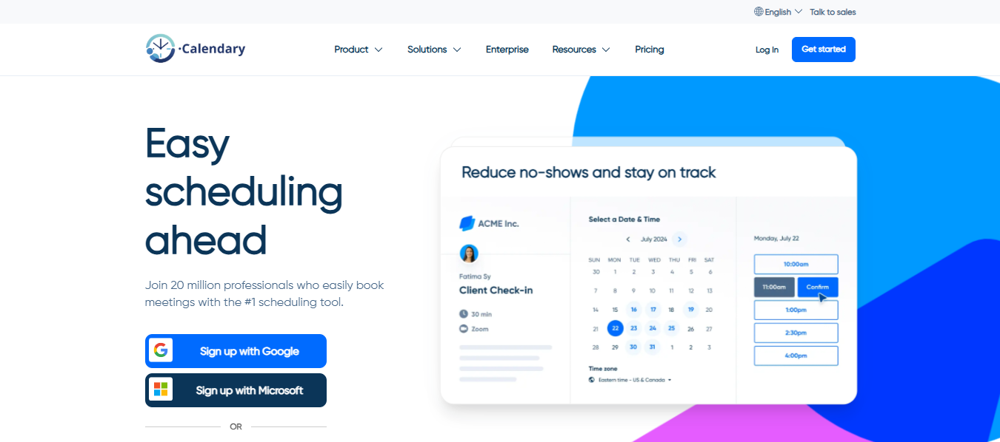

# 📆 Calendary – Visual Scheduling Homepage 

**Calendary** is a frontend-only, educational project inspired by the visual design of **Calendly**.  
It focuses on recreating a responsive and animated homepage using **React**, **CSS Modules**, **Vite**, and **pure CSS animations**.

---

## 🎯 Project Goals

Calendary was created with the intention to:

- 🧱 Practice responsive layout and visual structure
- 🎨 Recreate professional-level UI with custom design
- 💡 Explore component-based architecture with React
- 💫 Practice CSS transitions and animations
- 🚀 Improve frontend development workflow with Vite

---

## 🚀 Features

✅ Clean, structured homepage layout  
✅ Fully responsive design  
✅ Pure CSS animations (no libraries used)  
✅ Component-based architecture  
✅ Organized styling using CSS Modules  
❌ No backend — this is a static frontend project only

---

## 🧰 Tech Stack

**Frontend:**
- ✅ React 18+
- ✅ CSS Modules
- ✅ Vite
- ✅ Pure CSS (no animation libraries)

---

## 🖼️ Screenshots

### 💻 Home Page

 

---

## 📄 License

This project is licensed under the [MIT License](./LICENSE).

---

## 🛠️ Getting Started

Clone the project and start development locally:

```bash
git clone https://github.com/JuanBarbosaA/Calendary.git
cd Calendary
npm install
npm run dev
